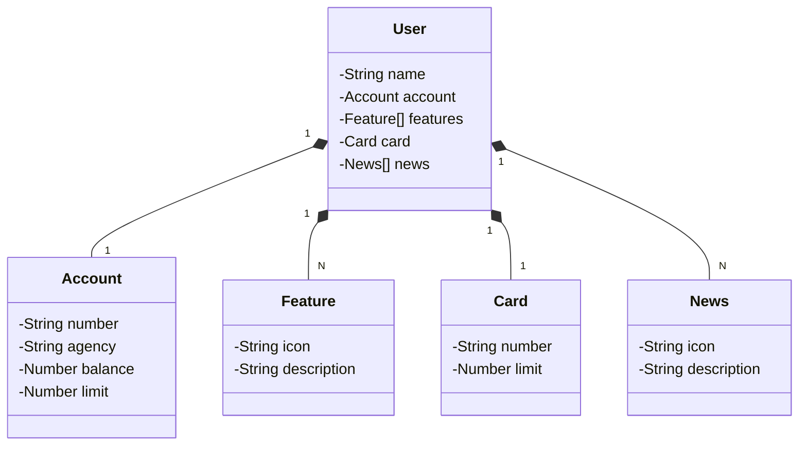

# Santander Java Backend 2024

Este é um projeto de API RESTful em Java desenvolvido com **Spring Boot 3** e **Java 17**. O projeto foi criado como conclusão do **Bootcamp Santander 2024 - Trilha Java Backend na Digital Innovation One (DIO)**.

### Diagrama de Classes



## Funcionalidades
- Gerenciamento de usuários
- Serviços de contas e cartões
- Funcionalidades para operações bancárias
- Exibe notícias financeiras

## Começando

### Pré-requisitos
- Java 17
- Gradle
- Git
- Postman (Ou outra ferramenta de testes de APIs)

### Instalação

1. Clone o repositório:
   ```bash
   git clone https://github.com/ja1steinert/santander-java-backend-2024.git
   cd santander-java-backend-2024
   ```
2. Construa o projeto:
   ```bash
   ./gradlew build
   ```
3. Execute a aplicação:
   ```bash
   ./gradlew bootRun
   ```
4. A API estará acessível em:
   ```bash
   http://localhost:8080
   ```
### Documentação da API

Você pode testar os endpoints da API usando o Postman ou outra ferramenta de testes. Os endpoints essenciais são:
- `/users`: Gerenciamento de usuários
- `/accounts`: Gerenciamento de contas
- `/cards`: Serviços relacionados a cartões
- `/news`: Obtém as notícias financeiras mais recentes

### Estrutura do Projeto

- **Controller**: Endpoints da API.
- **Service**: Lógica de negócios.
- **Repository**: Operações do banco de dados.
- **Model**: Entidades e seus relacionamentos.
